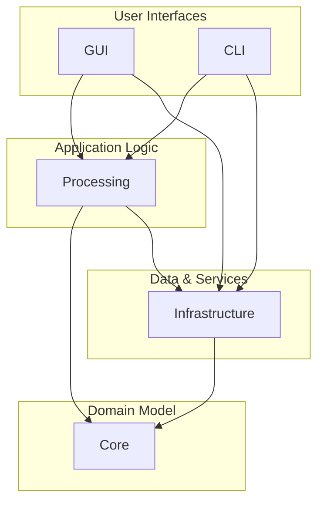

# M2.3: Final Solution Architecture

**Author:** Gemini & Alithanna
**Date:** 2024-07-26
**Status:** Finalized & Aligned with Codebase

## 1. Overview

This document outlines the final, refactored solution architecture for the TTRPG Converter. The structure is designed to follow modern software engineering principles, emphasizing a clean separation of concerns, maintainability, and testability. The architecture is built around a standard N-tier model with a clear, one-way dependency flow.

## 2. Project Roles and Responsibilities

The solution is divided into five distinct projects, each with a specific and well-defined purpose.

### 2.1. `TTRPGConverter.Core` (The Library)

-   **Purpose:** This is the heart of the application, designed as a pure, self-contained class library. It has no knowledge of the outside world (e.g., no file system, network, or database access).
-   **Contents:**
    -   **`Models/`**: Contains all data contracts and DTOs (e.g., `Roll20Models.cs`, `FoundryDnd5e.cs`, `PackProcessingResult.cs`).
    -   **`Mapping/`**: Contains all AutoMapper profiles, custom resolvers, and the `partial` class extensions needed to support the mapping logic.
-   **Key Principle:** This project can be compiled into a DLL and used by any other application. It has **zero** external dependencies other than the .NET standard libraries and AutoMapper.

### 2.2. `TTRPGConverter.Infrastructure` (The Implementation Details)

-   **Purpose:** This project contains the concrete implementations of services. It handles all external concerns and interactions with outside systems.
-   **Contents:**
    -   **`Assets/`**: Contains the `IAssetMapper` interface and its implementation, which handles all file downloading, caching, and optimization.
    -   **`Compendium/`**: Contains the `CompendiumCacheBuilder` and `FoundryModuleService`, which handle all database access (**EF Core + SQLite**) and compendium discovery.
    -   **`Roll20/`**: Contains services responsible for reading and parsing source `.zip` files.
    -   **`Foundry/`**: Contains services responsible for writing the final world structure to the disk.
-   **Key Principle:** This is the only project that should contain direct references to external libraries like `Microsoft.EntityFrameworkCore.Sqlite`, `ImageSharp`, or perform direct file system I/O.

### 2.3. `TTRPGConverter.Processing` (The Engine)

-   **Purpose:** This project is the "engine" of the application. It contains the high-level services that orchestrate the entire conversion process, using the services and interfaces from the other projects.
-   **Contents:**
    -   **`Conversion/`**: Contains the high-level orchestrators like `CampaignConverter` and `ConversionPipeline`.
-   **Key Principle:** The services in this project do not perform low-level work themselves; they delegate those tasks to the services in the `Infrastructure` project.

### 2.4. The User Interfaces

#### `TTRPGConverter.GUI`

-   **Purpose:** The primary user interface for the application, built with **Avalonia**.
-   **Contents:**
    -   `Views/`: Contains the `.axaml` files that define the UI layout.
    -   `ViewModels/`: Contains the ViewModels that drive the UI logic, following the MVVM pattern.
    -   `App.axaml.cs`: Contains the dependency injection container setup.
-   **Key Principle:** The GUI is a thin layer responsible for presenting data and capturing user input. ViewModels call services in the `Infrastructure` and `Processing` projects to perform work.

#### `TTRPGConverter.CLI`

-   **Purpose:** A secondary, command-line interface for headless operation.
-   **Key Principle:** A command class in this project should do nothing more than parse its arguments and make a single call to a high-level service.

## 3. Final Dependency Flow

This architecture results in a clean, one-way dependency flow that enhances testability and maintainability.

This structure is robust, scalable, and provides a solid foundation for all future development.
