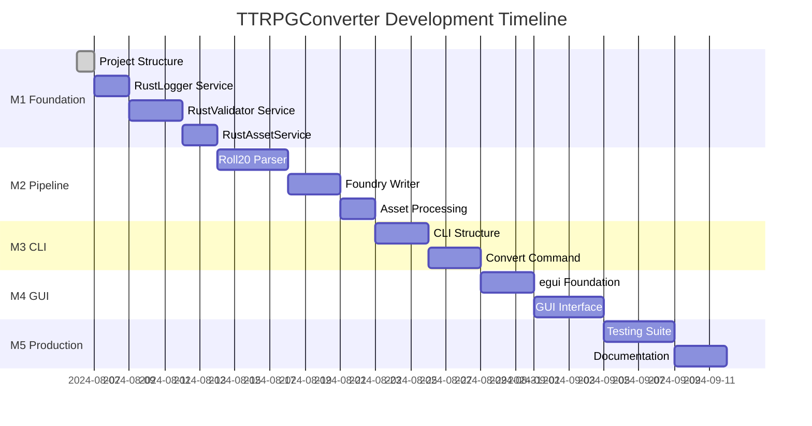

# 📊 TTRPGConverter Development Dashboard

**Project**: Pure Rust TTRPGConverter  
**Status**: 🟢 Active Development  
**Phase**: M1 Foundation Services  
**Last Updated**: 2024-08-06

---

## 🎯 Current Sprint: M1 Foundation Services

### Progress Overview
```progress
[████████░░░░░░░░░░░░░░░░] 23% Complete
6/26 story points completed
```

**Timeline**: 2 weeks (Due: Aug 20, 2024)  
**Status**: ✅ On Track  
**Velocity**: 6 pts/week (target: 6-7 pts/week)

### Active Tasks
- 🔄 **M1.1: Project Structure Setup** (6pts) - 85% complete
  - ✅ Error handling system (`error.rs`)
  - ✅ Core data types (`types.rs`)  
  - ✅ Service abstractions (`services.rs`)
  - 🔄 Validation module (in progress)
  - ⏳ Complete foundation testing

### Next Up
- **M1.2: RustLogger Service** (6pts) - Ready to start
- **M1.3: RustValidator Service** (8pts) - Architecture defined
- **M1.4: RustAssetService** (6pts) - Depends on validator

---

## 📈 Project Health Metrics

| Metric | Value | Status |
|--------|-------|--------|
| **Total Story Points** | 73 | 📊 |
| **Completed** | 6 (8%) | ✅ |
| **In Progress** | 6 (8%) | 🔄 |
| **Remaining** | 61 (84%) | 📋 |
| **Estimated Timeline** | 6-7 weeks | ⏰ |
| **Code Quality** | Excellent | 🟢 |
| **Test Coverage** | TBD | ⚪ |
| **Documentation** | Comprehensive | 🟢 |

---

## 🏗️ Architecture Status

### ✅ Completed Components
- **Error Handling**: Comprehensive `ConversionError` and `AssetError` types
- **Data Models**: Complete `Campaign`, `Actor`, `Scene`, `Item` etc. structures  
- **Service Layer**: Abstract service traits for dependency injection
- **Development Environment**: Full tooling setup (clippy, rustfmt, just, etc.)
- **Project Management**: Git + Obsidian integration

### 🔄 In Development  
- **Validation System**: Core validation traits and implementations
- **Service Manager**: Dependency injection coordination

### 📋 Planned Components
- **Logging Service**: Structured logging with multiple backends
- **Asset Service**: Download, cache, and process campaign assets  
- **Format Parsers**: Roll20 → Internal format conversion
- **Format Writers**: Internal → Foundry VTT conversion
- **CLI Interface**: User-friendly command-line tools
- **GUI Interface**: Native egui-based interface

---

## 🔗 Quick Navigation

### 🚀 Development
- [[📋 TTRPGConverter Pure Rust Kanban Board|Main Kanban Board]]
- [[../justfile|Development Commands]]
- [[../DEVELOPMENT_ENVIRONMENT_SETUP|Environment Setup]]

### 📋 Planning Documents  
- [[../M1_CORE_SERVICES_TASKS|M1: Core Services]] (Current)
- [[../M2_CORE_ENGINE_TASKS|M2: Conversion Pipeline]]
- [[../M3_CLI_INTERFACE_TASKS|M3: CLI Interface]]  
- [[../M4_GUI_INTERFACE_TASKS|M4: GUI Interface]]
- [[../M5_PRODUCTION_READY_TASKS|M5: Production Ready]]

### 🏗️ Architecture
- [[../ARCHITECTURAL_DECISIONS|Architecture Decisions]]
- [[../COMPREHENSIVE_PLANNING_INDEX|Planning Index]]

### 🛠️ Development Tools
- [[../install_dev_tools.ps1|Tool Installation]]
- [[../clippy.toml|Linting Configuration]]
- [[../.rustfmt.toml|Formatting Configuration]]

---

## 📝 Development Log

### Recent Sessions

**2024-08-06**  
**Focus**: Foundation Architecture + Obsidian Integration  
**Achievements**:
- ✅ Complete error handling system with contextual errors
- ✅ Comprehensive data type definitions for all TTRPG entities
- ✅ Service abstraction layer with dependency injection
- ✅ Obsidian vault integration with visual Kanban
- ✅ Professional development environment setup

**Time Spent**: ~4 hours  
**Blockers**: None  
**Next Session Focus**: Complete validation module, start RustLogger

---

## 🎯 Milestone Roadmap



---

## 🚨 Risk Assessment

| Risk | Probability | Impact | Mitigation |
|------|-------------|--------|------------|
| Scope Creep | Low | Medium | Detailed M1-M5 planning prevents feature drift |
| Technical Debt | Low | High | Code quality tools (clippy, tests) catch issues early |
| Timeline Pressure | Low | Medium | Conservative estimates with buffer time |
| Integration Issues | Medium | Medium | Service abstraction prevents tight coupling |

**Overall Risk**: 🟢 **LOW** - Well-planned architecture with proven patterns

---

## 💡 Key Insights & Decisions

### ✅ What's Working Well
- **Comprehensive Planning**: M1-M5 breakdown provides clear roadmap
- **Service Architecture**: Clean separation of concerns with dependency injection
- **Development Environment**: Professional tooling setup increases productivity
- **Error Handling**: Comprehensive error types with context improve debugging
- **Visual Management**: Obsidian integration provides excellent project visibility

### 🔄 Areas for Improvement
- **Testing Strategy**: Need to implement comprehensive test suite earlier
- **Performance Benchmarks**: Establish baseline metrics for optimization targets
- **Documentation**: Consider API documentation generation automation

### 🎯 Strategic Advantages
- **Pure Rust**: No Python integration overhead, superior performance
- **Single Binary**: Easy distribution and deployment
- **Modern Tooling**: Professional development workflow matches industry standards
- **Comprehensive Planning**: Junior developer could follow implementation guides

---

*Dashboard auto-generated from project metrics*  
*Refresh: Run `just metrics` to update statistics*
