# Universal TTRPG Platform - System Architecture

## 🎯 ARCHITECTURAL VISION

**Transformation**: From simple R20→Foundry converter to **Universal Visual Plugin Orchestration Platform**

**Revolutionary Capabilities**:
- **Visual Pipeline Builder**: Drag-and-drop plugin orchestration with real-time validation
- **Plugin Ecosystem**: Unlimited extensibility with automatic dependency resolution
- **Multi-Format**: Roll20, Foundry VTT, Fantasy Grounds, Pathbuilder with auto-discovery
- **Multi-System**: 5e ↔ PF1e ↔ PF2e ↔ Generic systems with rule engine integration
- **Performance**: Native Rust with DAG-optimized parallel pipelines
- **Professional UX**: Modern GUI with template galleries and interactive workflows

---

## 🚀 NEW PLUGIN ORCHESTRATION ARCHITECTURE

### **Revolutionary Plugin System Overview**

```mermaid
graph TB
    %% User Interface Layer
    subgraph "🎨 VISUAL INTERFACE LAYER"
        GUI_VISUAL["🖼️ Visual Pipeline Builder<br/>egui + egui_graphs<br/>Drag-and-drop DAG Editor<br/>Real-time Validation"]
        GUI_CLI["⚡ Smart CLI Interface<br/>Rust CLI with Plugin Discovery<br/>Pipeline Templates<br/>Interactive Workflows"]
    end

    %% Plugin Orchestration Engine
    subgraph "🔧 PLUGIN ORCHESTRATION ENGINE"
        DAGGY["📊 Pipeline Engine<br/>daggy - DAG Execution<br/>Automatic Dependency Resolution<br/>Parallel Processing"]
        SHAKU["🔗 Dependency Injection<br/>shaku - Service Container<br/>Plugin Lifecycle Management<br/>Type-safe Dependencies"]
        INVENTORY["📦 Plugin Registry<br/>inventory - Auto-discovery<br/>Compile-time Registration<br/>Metadata Management"]
        PETGRAPH["🕸️ Graph Analysis<br/>petgraph - Graph Algorithms<br/>Cycle Detection<br/>Optimization"]
    end

    %% Core Plugin Interfaces
    subgraph "🔌 UNIFIED PLUGIN INTERFACES"
        INPUT_PLUGINS["📥 Input Plugins<br/>Roll20InputPlugin<br/>FoundryInputPlugin<br/>FantasyGroundsInputPlugin<br/>PathbuilderInputPlugin"]
        PROCESS_PLUGINS["⚙️ Processing Plugins<br/>ValidationPlugin<br/>AssetPlugin<br/>ConversionPlugin<br/>OptimizationPlugin"]
        OUTPUT_PLUGINS["📤 Output Plugins<br/>FoundryOutputPlugin<br/>JSONExportPlugin<br/>PDFExportPlugin<br/>ModuleExportPlugin"]
        UTILITY_PLUGINS["🛠️ Utility Plugins<br/>LoggingPlugin<br/>MetricsPlugin<br/>CachePlugin<br/>SecurityPlugin"]
    end

    %% Rust Workspace Architecture
    subgraph "⚡ RUST WORKSPACE (~15K LOC)"
        subgraph "🎯 ttrpg-core (Core Engine)"
            TYPES["📋 Universal Types<br/>Campaign, Actor, Scene<br/>Cross-platform Compatibility"]
            PLUGINS_CORE["🔧 Plugin Framework<br/>Trait Definitions<br/>Lifecycle Management"]
            ORCHESTRATOR["🎭 Orchestration Engine<br/>Pipeline Builder<br/>Execution Coordinator"]
        end
        
        subgraph "🗂️ ttrpg-assets (Asset Processing)"
            ASSET_PLUGINS["🖼️ Asset Plugins<br/>Download, Cache, Optimize<br/>Multi-format Support"]
        end
        
        subgraph "📄 ttrpg-formats (Format Support)"
            FORMAT_PLUGINS["📝 Format Plugins<br/>JSON, XML, Database<br/>Auto-detection"]
        end
        
        subgraph "🖥️ ttrpg-cli (Command Interface)"
            CLI_ENGINE["⚡ CLI Engine<br/>Plugin Discovery<br/>Template Management"]
        end
        
        subgraph "🎨 ttrpg-gui (Visual Interface)"
            VISUAL_ENGINE["🖼️ Visual Engine<br/>egui Framework<br/>Pipeline Builder"]
        end
    end

    %% External Systems
    subgraph "📦 EXTERNAL PLATFORMS"
        ROLL20["🎲 Roll20<br/>Campaign Exports<br/>Asset References"]
        FOUNDRY["🏰 Foundry VTT<br/>v10, v11, v12+<br/>Module System"]
        FANTASY_GROUNDS["🛡️ Fantasy Grounds<br/>XML Campaigns<br/>Asset Packs"]
        PATHBUILDER["📱 Pathbuilder<br/>Character Data<br/>Mobile Integration"]
        CLOUD["☁️ Cloud Storage<br/>Google Drive, Dropbox<br/>Sync & Backup"]
    end

    %% Data Flow Connections
    GUI_VISUAL --> DAGGY
    GUI_CLI --> DAGGY
    
    DAGGY --> SHAKU
    SHAKU --> INVENTORY
    INVENTORY --> INPUT_PLUGINS
    INVENTORY --> PROCESS_PLUGINS
    INVENTORY --> OUTPUT_PLUGINS
    INVENTORY --> UTILITY_PLUGINS
    
    INPUT_PLUGINS --> TYPES
    PROCESS_PLUGINS --> TYPES
    OUTPUT_PLUGINS --> TYPES
    
    TYPES --> PLUGINS_CORE
    PLUGINS_CORE --> ORCHESTRATOR
    
    INPUT_PLUGINS --> ROLL20
    INPUT_PLUGINS --> FOUNDRY
    INPUT_PLUGINS --> FANTASY_GROUNDS
    INPUT_PLUGINS --> PATHBUILDER
    
    OUTPUT_PLUGINS --> FOUNDRY
    OUTPUT_PLUGINS --> CLOUD
    OTHERS --> PYO3
    
    SERVICES_PY --> PYO3
    
    PYO3 --> MANAGER
    MANAGER --> ASSET
    MANAGER --> VALIDATOR
    MANAGER --> LOGGER
    MANAGER --> MEDIA
    MANAGER --> DATABASE
    
    ASSET --> WEB
    DATABASE --> FOUNDRY
    CONVERTER --> ROLL20

    %% Styling
    classDef rustCrate fill:#ff6b35,stroke:#000,stroke-width:3px,color:#fff
    classDef pythonModule fill:#306998,stroke:#000,stroke-width:2px,color:#fff
    classDef guiModule fill:#42b883,stroke:#000,stroke-width:2px,color:#fff
    classDef integrationModule fill:#8e44ad,stroke:#000,stroke-width:2px,color:#fff
    classDef externalSystem fill:#95a5a6,stroke:#000,stroke-width:2px,color:#000
    
    class MANAGER,ASSET,VALIDATOR,LOGGER,MEDIA,DATABASE rustCrate
    class CONVERTER,ACTORS,SCENES,ITEMS,JOURNAL,OTHERS,SERVICES_PY,UTILS pythonModule
    class GUI_WEB,GUI_CLI guiModule
    class PYO3 integrationModule
    class FOUNDRY,ROLL20,WEB externalSystem
```



### **Current Architecture Analysis**

**✅ Strengths**:
- Solid Rust service foundation (~4K LOC)
- Clean Service Manager coordination pattern
- Functional PyO3 integration
- Working web-based UI

**🚨 Limitations**:
- Single crate becoming unwieldy (will reach 15K+ LOC)
- Python entity processing bottleneck (~11K LOC to migrate)
- No multi-system support
- Limited to R20→Foundry conversion
- No Foundry version migration capabilities

---

## 🏗️ TARGET FINAL ARCHITECTURE

### **Universal Platform Target State**

```mermaid
graph TB
    %% User Interface Layer
    subgraph "🖥️ USER INTERFACE LAYER"
        GUI_WEB["🌐 Modern Web GUI<br/>Vue 3 + Bootstrap 5<br/>📁 client/ directory<br/>~3K LOC Frontend<br/>✅ Dark Mode, Responsive"]
        GUI_CLI["⚡ CLI Interface<br/>📄 main.py<br/>~200 LOC<br/>🔧 Thin Python wrapper"]
        GUI_DESKTOP["🖥️ Optional Desktop GUI<br/>Tauri/Electron<br/>~1K LOC<br/>🚀 Future Enhancement"]
    end

    %% Python Compatibility Layer (Minimal)
    subgraph "🐍 PYTHON COMPATIBILITY LAYER (~2K LOC)"
        PYTHON_API["🔌 Python API Wrapper<br/>📄 R20Converter.py<br/>~500 LOC<br/>🔧 Backwards compatibility"]
        PYTHON_BINDINGS["🐍⚡ PyO3 Integration<br/>📄 bindings.py<br/>~300 LOC"]
        LEGACY_SUPPORT["📜 Legacy Support<br/>📁 legacy/<br/>~200 LOC<br/>🔧 Migration helpers"]
    end

    %% Rust Core System (Primary Implementation)
    subgraph "⚡ RUST CORE SYSTEM (~30K+ LOC)"
        subgraph "🏗️ CRATE: r20converter-core (~1K LOC)"
            MANAGER["🎯 Service Manager<br/>📄 manager.rs<br/>~400 LOC<br/>✅ Enhanced coordination"]
            ERROR["❌ Error System<br/>📄 error.rs<br/>~300 LOC<br/>✅ Comprehensive errors"]
            TYPES["📋 Core Types<br/>📄 types.rs<br/>~300 LOC<br/>✅ Shared definitions"]
        end
        
        subgraph "🔧 CRATE: r20converter-services (~8K LOC)"
            ASSET_SVC["🗂️ Asset Service<br/>📁 asset/<br/>~2,000 LOC<br/>✅ Enhanced caching"]
            VALIDATOR_SVC["✅ Validator<br/>📁 validator/<br/>~1,500 LOC<br/>✅ Multi-system rules"]
            LOGGER_SVC["📝 Logger<br/>📁 logger/<br/>~800 LOC<br/>✅ Structured logging"]
            MEDIA_SVC["🎨 Media Optimizer<br/>📁 media/<br/>~2,000 LOC<br/>✅ Advanced processing"]
            PERMISSION_SVC["🔐 Permissions<br/>📁 permissions/<br/>~1,000 LOC<br/>🆕 New service"]
            COMPENDIUM_SVC["📚 Compendium<br/>📁 compendium/<br/>~1,500 LOC<br/>🆕 Multi-system"]
        end
        
        subgraph "🗃️ CRATE: r20converter-database (~5K LOC)"
            DATABASE_CORE["💾 Database Core<br/>📄 core.rs<br/>~1,000 LOC"]
            LEVELDB_HANDLER["🗄️ LevelDB Handler<br/>📄 leveldb.rs<br/>~1,500 LOC<br/>✅ Foundry v12+"]
            NEDB_HANDLER["📁 NeDB Handler<br/>📄 nedb.rs<br/>~1,200 LOC<br/>✅ Foundry v10-v11"]
            MIGRATION_TOOLS["🔄 Migration Tools<br/>📄 migrate.rs<br/>~1,000 LOC<br/>✅ Version upgrades"]
        end
        
        subgraph "🎭 CRATE: r20converter-entities (~10K LOC)"
            subgraph "System-Agnostic Entities (~6K LOC)"
                SCENE_PROCESSOR["🗺️ Scene Processor<br/>📁 scenes/<br/>~2,500 LOC<br/>🔄 Enhanced from Python"]
                JOURNAL_PROCESSOR["📰 Journal Processor<br/>📁 journal/<br/>~1,000 LOC<br/>🔄 Migrated from Python"]
                SUPPORTING_ENTITIES["🔧 Supporting Entities<br/>📁 support/<br/>~2,500 LOC<br/>Tables, Playlists, etc."]
            end
            subgraph "System-Specific Entities (~4K LOC)"
                ACTOR_PROCESSOR["👥 Actor Processor<br/>📁 actors/<br/>~2,500 LOC<br/>🔄 Migrated from Python"]
                ITEM_PROCESSOR["🎒 Item Processor<br/>📁 items/<br/>~1,500 LOC<br/>🔄 Migrated from Python"]
            end
        end
        
        subgraph "🔄 CRATE: r20converter-conversion (~6K LOC)"
            CONVERSION_ENGINE["⚙️ Conversion Engine<br/>📄 engine.rs<br/>~2,000 LOC<br/>🆕 Core orchestration"]
            ROLL20_PARSER["🎲 Roll20 Parser<br/>📄 roll20.rs<br/>~1,500 LOC<br/>✅ Enhanced parsing"]
            FOUNDRY_BUILDER["🏰 Foundry Builder<br/>📄 foundry.rs<br/>~1,500 LOC<br/>✅ Multi-version support"]
            CROSS_SYSTEM["🔄 Cross-System Engine<br/>📄 cross_system.rs<br/>~1,000 LOC<br/>🆕 5e↔PF1e↔PF2e"]
        end
        
        subgraph "🌐 CRATE: r20converter-integrations (~3K LOC)"
            PATHBUILDER["📋 Pathbuilder Export<br/>📄 pathbuilder.rs<br/>~1,000 LOC<br/>🆕 JSON export"]
            FOUNDRY_MIGRATION["🏰 Foundry Migration<br/>📄 foundry_migrate.rs<br/>~1,500 LOC<br/>🆕 v10↔v12"]
            EXTERNAL_APIS["🌐 External APIs<br/>📄 external.rs<br/>~500 LOC<br/>🚀 Future integrations"]
        end
    end

    %% Integration & API Layer
    subgraph "🔌 INTEGRATION & API LAYER"
        PYO3_BINDINGS["🐍⚡ PyO3 Bindings<br/>📄 lib.rs<br/>~1,000 LOC<br/>✅ Complete API exposure"]
        REST_API["🌐 REST API<br/>📁 api/<br/>~600 LOC<br/>🆕 Optional web service"]
        WASM_BINDINGS["🕸️ WASM Bindings<br/>📄 wasm.rs<br/>~400 LOC<br/>🚀 Future web integration"]
    end

    %% External Systems
    subgraph "📦 EXTERNAL SYSTEMS"
        FOUNDRY_V12["🏰 Foundry VTT v12+<br/>LevelDB Format<br/>✅ Primary target"]
        FOUNDRY_V10["🏰 Foundry VTT v10-v11<br/>NeDB Format<br/>✅ Legacy support"]
        ROLL20_MODERN["🎲 Roll20 Exports<br/>Modern ZIP/JSON<br/>✅ Enhanced parsing"]
        EXTERNAL_ASSETS["🌐 External Assets<br/>CDNs, Web Resources<br/>✅ Smart caching"]
        COMPENDIUMS["📚 Official Compendiums<br/>D&D 5e, PF1e, PF2e<br/>✅ Multi-system"]
        PATHBUILDER_PLATFORM["📋 Pathbuilder Platform<br/>JSON Integration<br/>✅ Custom content export"]
    end

    %% Data Flow - Universal Platform
    GUI_WEB --> PYTHON_API
    GUI_CLI --> PYTHON_API
    GUI_DESKTOP --> REST_API
    
    PYTHON_API --> PYO3_BINDINGS
    PYTHON_BINDINGS --> PYO3_BINDINGS
    
    PYO3_BINDINGS --> MANAGER
    REST_API --> MANAGER
    
    MANAGER --> ASSET_SVC
    MANAGER --> VALIDATOR_SVC
    MANAGER --> LOGGER_SVC
    MANAGER --> MEDIA_SVC
    MANAGER --> PERMISSION_SVC
    MANAGER --> COMPENDIUM_SVC
    
    MANAGER --> DATABASE_CORE
    DATABASE_CORE --> LEVELDB_HANDLER
    DATABASE_CORE --> NEDB_HANDLER
    DATABASE_CORE --> MIGRATION_TOOLS
    
    MANAGER --> CONVERSION_ENGINE
    CONVERSION_ENGINE --> SCENE_PROCESSOR
    CONVERSION_ENGINE --> JOURNAL_PROCESSOR
    CONVERSION_ENGINE --> SUPPORTING_ENTITIES
    CONVERSION_ENGINE --> ACTOR_PROCESSOR
    CONVERSION_ENGINE --> ITEM_PROCESSOR
    
    CONVERSION_ENGINE --> ROLL20_PARSER
    CONVERSION_ENGINE --> FOUNDRY_BUILDER
    CONVERSION_ENGINE --> CROSS_SYSTEM
    
    MANAGER --> PATHBUILDER
    MANAGER --> FOUNDRY_MIGRATION
    MANAGER --> EXTERNAL_APIS
    
    ROLL20_PARSER --> ROLL20_MODERN
    ASSET_SVC --> EXTERNAL_ASSETS
    DATABASE_CORE --> FOUNDRY_V12
    DATABASE_CORE --> FOUNDRY_V10
    FOUNDRY_BUILDER --> COMPENDIUMS
    PATHBUILDER --> PATHBUILDER_PLATFORM
    FOUNDRY_MIGRATION --> FOUNDRY_V12
    FOUNDRY_MIGRATION --> FOUNDRY_V10

    %% Styling
    classDef rustCrate fill:#ff6b35,stroke:#000,stroke-width:3px,color:#fff
    classDef pythonModule fill:#306998,stroke:#000,stroke-width:2px,color:#fff
    classDef guiModule fill:#42b883,stroke:#000,stroke-width:2px,color:#fff
    classDef integrationModule fill:#8e44ad,stroke:#000,stroke-width:2px,color:#fff
    classDef externalSystem fill:#95a5a6,stroke:#000,stroke-width:2px,color:#000
    classDef newFeature fill:#e74c3c,stroke:#000,stroke-width:2px,color:#fff
    
    class MANAGER,ERROR,TYPES,ASSET_SVC,VALIDATOR_SVC,LOGGER_SVC,MEDIA_SVC,PERMISSION_SVC,COMPENDIUM_SVC rustCrate
    class DATABASE_CORE,LEVELDB_HANDLER,NEDB_HANDLER,MIGRATION_TOOLS rustCrate
    class SCENE_PROCESSOR,JOURNAL_PROCESSOR,SUPPORTING_ENTITIES,ACTOR_PROCESSOR,ITEM_PROCESSOR rustCrate
    class CONVERSION_ENGINE,ROLL20_PARSER,FOUNDRY_BUILDER,CROSS_SYSTEM rustCrate
    class PATHBUILDER,FOUNDRY_MIGRATION,EXTERNAL_APIS rustCrate
    class PYTHON_API,PYTHON_BINDINGS,LEGACY_SUPPORT pythonModule
    class GUI_WEB,GUI_CLI,GUI_DESKTOP guiModule
    class PYO3_BINDINGS,REST_API,WASM_BINDINGS integrationModule
    class FOUNDRY_V12,FOUNDRY_V10,ROLL20_MODERN,EXTERNAL_ASSETS,COMPENDIUMS,PATHBUILDER_PLATFORM externalSystem
    class PERMISSION_SVC,COMPENDIUM_SVC,CONVERSION_ENGINE,CROSS_SYSTEM,PATHBUILDER,FOUNDRY_MIGRATION newFeature
```



---

## 🔄 ARCHITECTURAL EVOLUTION PATH

### **Phase 1: Foundation (Current → 3 Crates)**
```
r20converter-rust (single crate)
↓ SPLIT ↓
r20converter-core/      (~400 LOC) - Service coordination
r20converter-services/  (~3K LOC)  - Business logic services  
r20converter-database/  (~100 LOC) - Database abstraction
```

### **Phase 3: Entity Migration (3 → 5 Crates)**  
```
Add r20converter-entities/ (~10K LOC) - Entity processing
Split system-agnostic vs system-specific processing
```

### **Phase 4: Universal Platform (5 → 7+ Crates)**
```
Add r20converter-conversion/   (~6K LOC) - Conversion orchestration
Add r20converter-integrations/ (~3K LOC) - Platform integrations
Optional specialized splits as services grow
```

---

## 📊 MULTI-SYSTEM COMPLEXITY ANALYSIS

### **Entity System Specificity Breakdown**

**🔥 System-Specific Entities (40% of complexity)**:
- **Actors**: Character sheets, classes, stats, abilities
  - D&D 5e: Ability scores, classes, backgrounds, spells
  - PF1e: Different ability system, different classes, feats
  - PF2e: Completely different action economy, conditions, traits
- **Items**: Weapons, armor, equipment with system-specific stats
- **Spells**: System-specific casting mechanics and spell schools

**✅ System-Agnostic Entities (60% of complexity)**:
- **Scenes**: Maps, lighting, walls, terrain (universal concepts)
- **Journal**: Handouts, notes, lore (content-based)
- **Tables**: Roll tables, random generation (mechanics-agnostic)
- **Playlists**: Audio files, music (universal media)
- **Folders**: Organization, structure (metadata)

### **Cross-System Conversion Matrix**

**Supported Conversion Paths** (16 total combinations):
```
From    | To 5e  | To PF1e | To PF2e | To Generic
--------|--------|---------|---------|----------
5e      | —      | ✅      | ✅      | ✅
PF1e    | ✅      | —       | ✅      | ✅  
PF2e    | ✅      | ✅       | —       | ✅
Generic | ✅      | ✅       | ✅      | —
```

**Conversion Complexity Factors**:
- **Actor Stats**: Ability score systems vary significantly
- **Class Features**: Different progression and mechanics
- **Item Properties**: Different stat systems and item types
- **Spell Systems**: Different schools, components, mechanics

---

## ⚡ PERFORMANCE ARCHITECTURE

### **Performance Targets**

**Current Python Performance** (baseline):
- **Large Campaign** (500+ entities): 15-30 minutes
- **Asset Processing**: 5-15 minutes for 100 images
- **Memory Usage**: 500MB-1GB during conversion

**Target Rust Performance**:
- **Large Campaign**: 1-3 minutes (10-25x improvement)
- **Asset Processing**: 30 seconds-2 minutes (10-15x improvement)  
- **Memory Usage**: 100-200MB (5x reduction)

### **Performance Architecture Strategies**

**🔄 Parallel Processing**:
- Entity processing pipeline with parallel workers
- Asset downloading and optimization in parallel
- Database operations with connection pooling

**💾 Memory Optimization**:
- Streaming processing for large campaigns
- Zero-copy operations where possible
- Efficient data structures (Vec, HashMap optimization)

**🗄️ Caching Strategy**:
- Asset cache with intelligent invalidation
- Compendium data caching across conversions
- Conversion result caching for incremental updates

---

## 🔧 INTEGRATION ARCHITECTURE

### **Python Integration Strategy**

**Phase 1-2: PyO3 Bridge Approach**
- Maintain full Python compatibility
- Gradual migration of performance-critical components
- Service Manager coordinates both Python and Rust services

**Phase 3+: Rust-First Approach**  
- Python becomes thin wrapper around Rust core
- Legacy compatibility layer for existing scripts
- Performance-critical paths entirely in Rust

### **Multi-Platform Export Architecture**

**Export Format Support**:
```rust
pub trait ExportFormat {
    fn export_world(&self, world: &ConvertedWorld) -> Result<ExportResult>;
    fn export_entities(&self, entities: &[Entity]) -> Result<ExportResult>;
    fn validate_export(&self, data: &ExportData) -> ValidationResult;
}

// Implementations:
impl ExportFormat for FoundryExporter { /* Multi-version Foundry */ }
impl ExportFormat for PathbuilderExporter { /* Pathbuilder JSON */ }
impl ExportFormat for GenericJSONExporter { /* Future formats */ }
```

**Integration Points**:
- **Foundry VTT**: Direct database manipulation (LevelDB/NeDB)
- **Pathbuilder**: JSON export for custom campaign content
- **External Tools**: REST API for third-party integrations

---

## 🛡️ RELIABILITY & ROBUSTNESS

### **Error Handling Architecture**

**Hierarchical Error System**:
```rust
// Core error types with context preservation
pub enum ConversionError {
    EntityError { entity_type: String, entity_id: String, source: Box<dyn Error> },
    AssetError { asset_path: String, source: AssetError },
    DatabaseError { operation: String, source: DatabaseError },
    ValidationError { rule: String, details: ValidationDetails },
}
```

### **Validation Architecture**

**Multi-Layer Validation**:
1. **Input Validation**: Roll20 data format and integrity
2. **Conversion Validation**: Entity-specific business rules
3. **System Validation**: Target system compatibility  
4. **Output Validation**: Foundry/Pathbuilder format compliance

### **Recovery & Rollback**

**Transactional Operations**:
- Database operations with rollback capability
- Asset processing with cleanup on failure
- Partial conversion recovery and resume

This architecture provides a solid foundation for transforming R20Converter into a comprehensive Universal TTRPG Campaign Conversion Platform while maintaining reliability, performance, and extensibility.
